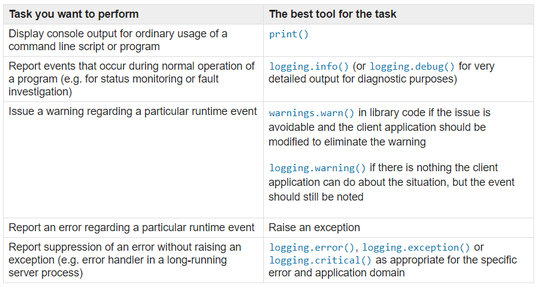
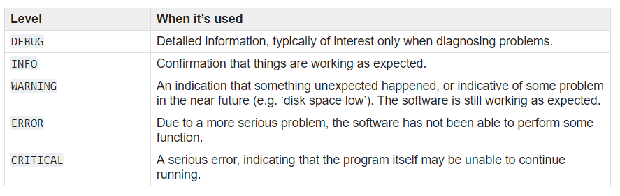

# Python для сетевых инженеров 

---
## Welcome to продленка :)

---

## Модуль logging


---
### Базовый пример

+++?code=code/logging_basic_1.py&lang=python&title=logging_basic_1.py

@[1]
@[3]
@[5-7]

+++
### Log-файл

```
DEBUG:root:Сообщение уровня debug
INFO:root:Сообщение уровня info
WARNING:root:Сообщение уровня warning
```

+++?code=code/logging_basic_2.py&lang=python&title=logging_basic_2.py

@[1]
@[3]
@[5-7]

+++
### Log-файл

```
DEBUG:root:Сообщение уровня debug:
{'__name__': '__main__', '__doc__': None, '__package__': None, '__loader__': <_frozen_importlib_external.SourceFileLoader object at 0xb72a57ac>, '__spec__': None, '__annotations__': {}, '__builtins__': <module 'builtins' (built-in)>, '__file__': 'logging_basic_2.py', '__cached__': None, 'logging': <module 'logging' from '/usr/local/lib/python3.6/logging/__init__.py'>}
INFO:root:Сообщение уровня info
WARNING:root:Сообщение уровня warning
```

---
### Рекомендации

+++
### Когда использовать модуль logging



+++
### Уровни



---
### Компоненты модуля logging

* Logger - это основной интерфейс для работы с модулем
* Handler - отправляет log-сообщения конкретному получателю
* Filter - позволяет фильтровать сообщения
* Formatter - указывает формат сообщения

+++?code=code/logging_api_example_1.py&lang=python&title=logging_api_example_1.py

@[1]
@[3]
@[5-8]

+++
### Результат выполнения

```
$ python logging_api_example_1.py
Сообщение уровня warning
```

По умолчанию вывод идет в stderr и уровень warning.

+++?code=code/logging_api_example_2.py&lang=python&title=logging_api_example_2.py

@[1]
@[3-4]
@[6-7]
@[8-10]
@[12]
@[14-17]

+++
### Результат выполнения

```
$ python logging_api_example_2.py
16:30:07 - My Script - DEBUG - Сообщение уровня debug
16:30:07 - My Script - INFO - Сообщение уровня info
16:30:07 - My Script - WARNING - Сообщение уровня warning
```

